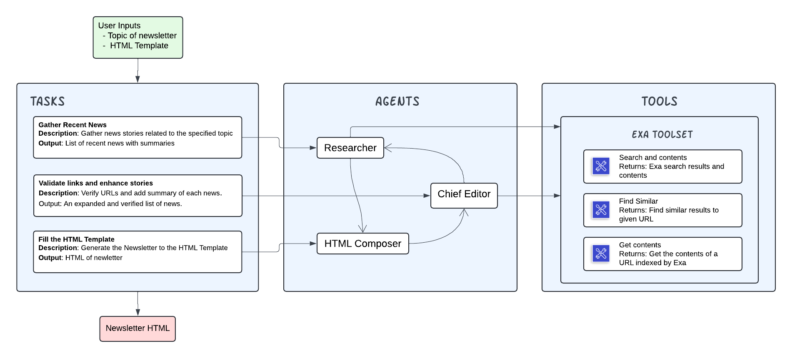

# AI-Powered Newsletter Generation with Exa Research Agent & CrewAI

This project demonstrates how to generate an AI-powered newsletter using Exa's semantic search capabilities and CrewAI's orchestration of research agents. The system automates the entire newsletter creation process, from gathering the latest news on a specified topic to compiling it into an HTML newsletter template.

## Architecture Overview



The system is designed to function with three main agents: Researcher, Chief Editor, and HTML Composer. The agents use Exa’s toolset to gather recent news, validate links, enhance the content, and fill the provided HTML template to generate a finalized newsletter.

### Agents:
1. **Researcher** - Gathers recent news related to the specified topic and summarizes it.
2. **Chief Editor** - Validates the content, rewrites headlines, and ensures the relevance and quality of the news.
3. **HTML Composer** - Fills the provided HTML template with the verified content, generating the final newsletter.

### Tools:
The system leverages the **Exa toolset**, which includes:
- **Search and Contents**: Fetches search results based on semantic queries.
- **Find Similar**: Finds similar content based on a provided URL.
- **Get Contents**: Retrieves the contents of a URL indexed by Exa.

## Features

- **Semantic Search**: Instead of traditional keyword-based search, this system uses Exa’s semantic search API to retrieve content based on meaning, providing more relevant news results.
- **Automated Content Validation**: Ensures that URLs are valid and the news is recent and relevant.
- **HTML Newsletter Generation**: Automatically fills a provided HTML template with news content, generating a complete newsletter with minimal manual input.

## Installation

1. Clone the repository:
   ```bash
   git clone https://github.com/yourusername/ai-newsletter-generator.git
   cd ai-newsletter-generator
   ```
Next, navigate to your project directory and install the dependencies:

2. First lock the dependencies and then install them:
```bash
poetry lock
```
```bash
poetry install
```
## Customizing

**Add your `OPENAI_API_KEY` into the `.env` file**

- Modify `src/newsletter_gen/config/agents.yaml` to define your agents
- Modify `src/newsletter_gen/config/tasks.yaml` to define your tasks
- Modify `src/newsletter_gen/crew.py` to add your own logic, tools and specific args
- Modify `src/newsletter_gen/main.py` to add custom inputs for your agents and tasks

## Running the Project

To kickstart your crew of AI agents and begin task execution, run this from the root folder of your project:

```bash
poetry run newsletter_gen
```

This command initializes the newsletter-gen Crew, assembling the agents and assigning them tasks as defined in your configuration.

This example, unmodified, will run the create a `report.md` file with the output of a research on LLMs in the root folser

## Understanding Your Crew

The newsletter-gen Crew is composed of multiple AI agents, each with unique roles, goals, and tools. These agents collaborate on a series of tasks, defined in `config/tasks.yaml`, leveraging their collective skills to achieve complex objectives. The `config/agents.yaml` file outlines the capabilities and configurations of each agent in your crew.


